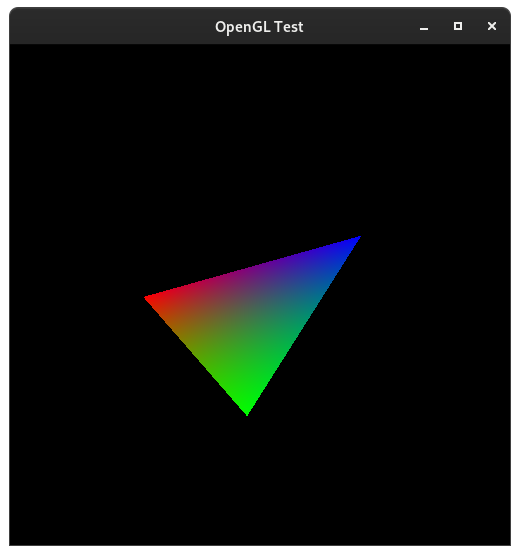

# OpenGL Test
Simple OpenGL test application that should render a colored triangle on the screen.



## Author
- lyrahgames (lyrahgames@mailbox.org)

## Requirements
- C++ Standard: C++17
- C++ Compiler: GCC | Clang | Nuwen MinGW | MinGW | MSVC
- Operating System: Linux | Windows
- Build System: [build2](https://build2.org)
- Libraries:
    + [glbinding](https://glbinding.org/)
    + [GLFW](https://www.glfw.org/)
    + [GLM](https://glm.g-truc.net/0.9.9/index.html)

## Build System Explanation
This simple test consists mainly of the `buildfile` and the `main.cpp` file.
Typically, build2 demands a more sophisticated composition of buildfiles to allow for advanced functionality, like persistent configurations.
Because this is a simple test, using the simplest build mechanisms based on a single `buildfile` seemed to achieve the most comprehension.
Furthermore, in my opinion, it shows the superiority of the build2 build system compared to Make or CMake.

But for testing reasons and for enabling configuration in an editor, we could easily add further functionality by adding the `build/bootstrap.build` file with the following content.
```
# build/bootstrap.build
project = opengl-test

using config
using test
```
Now, run `b configure` to generate a valid default `build/config.build` file and adjust your in-source persistent configuration.
```
# build/config.build
# ...
config.cxx = #...
config.cxx.poptions = #...
config.cxx.coptions = #...
config.cxx.loptions = #...
# ...
```
Afterwards, running `b test` without all those command-line arguments to compile and run the application should suffice.

## Build and Run with build2
This code explicitly uses only the build system of the build2 compiler toolchain to elaborate on alternative build techniques.

### Linux
Make sure all dependencies are installed.
Open a terminal in the project root and run the following command to build and run the code.

    b test

For a custom configuration, you can run something like the following.

    b test \
        config.cxx=clang++ \
        "config.cxx.coptions=-O3 -march=native"

### Windows
#### Nuwen MinGW Compiler Distribution
On Windows, I recommend to use the [Nuwen MinGW compiler distribution](https://nuwen.net/mingw.html) because in this distribution of MinGW all needed dependencies are already installed.
Use a custom configuration to be able to find the static libraries.
We want to use the static version of the GLFW library.
Hence, we have to additionally link the library `gdi32` into the application.

    b test \
        config.cxx=g++ \
        "config.cxx.poptions=-IC:/MinGW/include" \
        "config.cxx.coptions=-O3 -march=native" \
        "config.cxx.loptions=-LC:/MinGW/lib" \
        "config.cxx.libs=-lgdi32"

#### Microsoft C++ Compiler or MinGW
Using the Microsoft C++ compiler or the standard MinGW compiler distribution, we will probably use dynamic libraries.
So make sure to install all dependencies to appropriate locations and get their include and library paths.
Of course, we have to customize this configuration as well.
Call the following command inside the developer prompt of the MSVC.

    b test \
        config.cxx=cl \
        "config.cxx.poptions=/IC:/GLFW/include /IC:/glbinding/include /IC:/glm" \
        "config.cxx.coptions=/O2" \
        "config.cxx.loptions=/LIBPATH:C:/GLFW/lib /LIBPATH:C:/glbinding/lib"

## Usage
- Escape: Quit the program.
